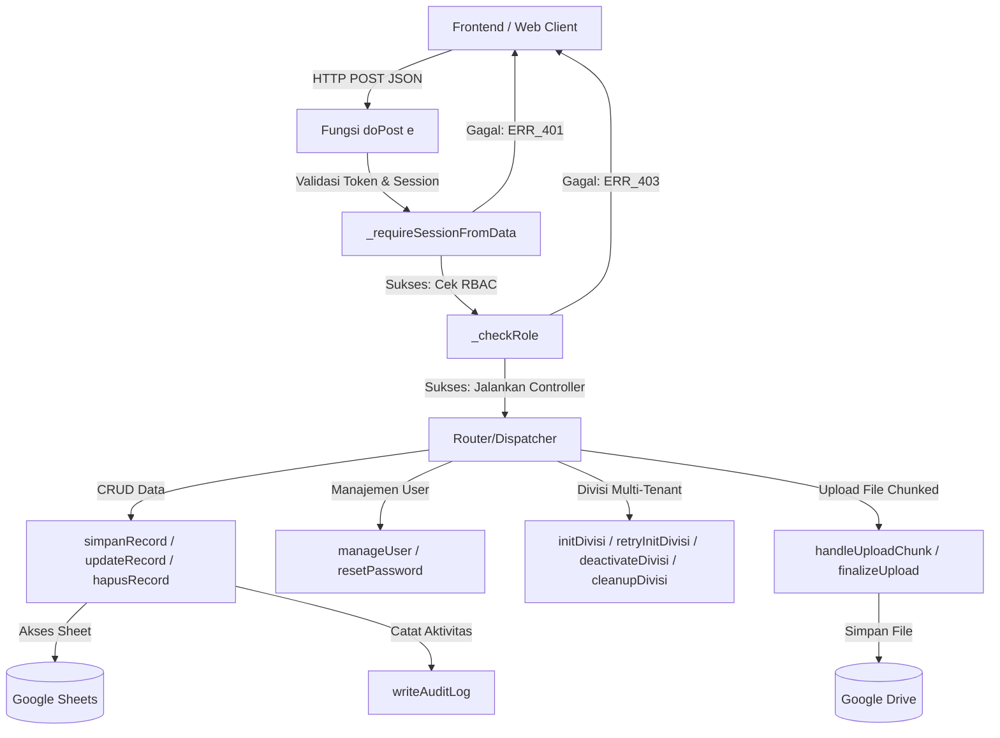

# Dokumentasi Logika dan Fungsi Backend (Google Apps Script) — SISURAT

Dokumen ini berisi penjelasan detail mengenai arsitektur, basis data, alur kerja, logika bisnis, keamanan, dan rincian fungsi pada backend **SISURAT** (Sistem Informasi Surat) yang diimplementasikan menggunakan **Google Apps Script (GAS)** dengan **Google Sheets** sebagai database-nya. Dokumen ini disusun untuk mendukung penulisan Laporan Tugas Akhir.

---

## Konteks Umum & Peruntukan Aplikasi

**SISURAT (Sistem Informasi Surat) Multi-Divisi** adalah sistem informasi berbasis web yang dirancang khusus untuk mengelola pengarsipan surat masuk, surat keluar, dan administrasi pengambilan piagam penghargaan secara digital. Sistem ini ditujukan untuk digunakan di **Dinas Pendidikan, Kebudayaan, Kepemudaan, dan Olahraga (Disdikbudpora) Kabupaten Semarang**.

### Peruntukan & Masalah yang Diselesaikan:
1. **Multi-Divisi (Multi-Tenant Isolation)**: Mendukung integrasi pengelolaan arsip di lebih dari 10 divisi internal Disdikbudpora Kabupaten Semarang. Setiap divisi memiliki ruang penyimpanan data yang terisolasi secara server-side, sehingga divisi lain tidak dapat melihat atau mengubah data divisi lainnya tanpa otoritas yang sah.
2. **Infrastruktur Zero-Budget**: Memanfaatkan infrastruktur ekosistem Google (Google Sheets sebagai basis data relasional, Google Drive untuk penyimpanan berkas lampiran surat/tanda tangan, dan Google Apps Script sebagai API backend serverless) guna meminimalkan biaya operasional sistem (zero-budget hosting & maintenance).
3. **Pengarsipan Digital Terpusat**: Menggantikan alur pengarsipan manual dan input Google Forms yang tidak terpusat menjadi form kustom terintegrasi dengan tanda tangan canvas digital untuk penyerahan piagam.
4. **Keamanan & Akuntabilitas**: Memastikan seluruh perubahan data terdokumentasi dengan sistem *Audit Log* digital dan batasan hak akses ketat (RBAC) bagi Super Admin, Admin Divisi, maupun Operator.

---

## 1. Arsitektur Umum & Alur Kerja (Workflow)

SISURAT menggunakan arsitektur **Serverless** berbasis Google Apps Script. Web client (frontend HTML/JS) berinteraksi dengan backend melalui protokol HTTP POST.

---

## 2. Struktur Basis Data (Google Sheets Schema)

Sistem ini menerapkan konsep **Multi-Divisi (Multi-Tenant)**. Database terbagi menjadi sheet global dan sheet spesifik divisi.

### a. Sheet Global (Global Tables)

1. **`db_users`** (Manajemen Pengguna & Autentikasi)
   - `username` (Text, Primary Key)
   - `password` (Text, Legacy)
   - `role` (Text: super_admin, admin_divisi, admin, operator)
   - `nama` (Text)
   - `email` (Text)
   - `role_id` (Text)
   - `aktif` (Boolean / TRUE/FALSE)
   - `divisi_id` (Text, Foreign Key ke `db_divisi`)
   - `scope` (Text: global / divisi)
   - `password_hash` (SHA-256)
   - `password_salt` (UUID string)
   - `password_v` (Versi password hashing, e.g., "2" untuk enkripsi baru)

2. **`db_divisi`** (Daftar Divisi Aktif)
   - `id` / `kode_divisi` (Text, Primary Key, e.g., "DIV01")
   - `nama_divisi` (Text)
   - `status` (Text: pending, active, inactive, cleanup)
   - `drive_folder_id` (Text, Folder ID di Google Drive)
   - `created_at` (Datetime)
   - `created_by` (Text)

3. **`db_audit_log`** (Sistem Audit Log untuk Security)
   - `timestamp` (Datetime)
   - `actor` (Text, Username pengubah)
   - `role` (Text)
   - `divisi_id` (Text)
   - `action` (Text: login, create, update, delete, logout, dll.)
   - `table_name` (Text)
   - `record_id` (Text/UUID)
   - `detail` (Text, Deskripsi tindakan)

4. **`db_summary`** (Agregasi Data Per-Divisi)
   - `divisi_id` (Text, Primary Key)
   - `total_surat_masuk` (Integer)
   - `total_surat_keluar` (Integer)
   - `total_piagam` (Integer)
   - `last_updated` (Datetime)

5. **`ref_sekolah`** (Tabel Referensi Sekolah)
   - `id` (UUID)
   - `nama_sekolah` (Text)
   - `npsn` (Text)
   - `aktif` (Boolean)

6. **`db_config`** (Pengaturan Aplikasi Global)
   - `key` (Text)
   - `value` (Text)

---

### b. Sheet Spesifik Divisi (Dynamic Tenant Tables)
Setiap divisi baru yang di-inisialisasi oleh `super_admin` akan otomatis dibuatkan 5 sheet khusus dengan prefix **`{KODE_DIVISI}_`**:

1. **`{KODE_DIVISI}_surat_masuk`**
   - Kolom: `id` (UUID), `timestamp`, `email_address`, `nama_pengupload`, `divisi_id`, `asal_surat`, `nomor_surat`, `tanggal_surat`, `perihal`, `tanggal_diterima`, `upload_file`, `is_deleted`, `deleted_at`, `deleted_by`.
2. **`{KODE_DIVISI}_surat_keluar`**
   - Kolom: `id` (UUID), `timestamp`, `email_address`, `nama_pengupload`, `divisi_id`, `nomor_surat`, `tanggal_surat`, `perihal`, `tanggal_share`, `upload_file`, `is_deleted`, `deleted_at`, `deleted_by`.
3. **`{KODE_DIVISI}_piagam`**
   - Kolom: `id` (UUID), `timestamp`, `email_address`, `nama_pengupload`, `divisi_id`, `nama_pengambil`, `jabatan`, `unit_kerja`, `npsn`, `pengambilan`, `jenis_perlombaan`, `tahun_perlombaan`, `nama_siswa`, `asal_sekolah`, `ttd_pengambil`, `is_deleted`, `deleted_at`, `deleted_by`.
4. **`{KODE_DIVISI}_ref_pengambilan`**
   - Kolom: `id` (UUID), `nama`, `aktif`.
5. **`{KODE_DIVISI}_ref_jenis`**
   - Kolom: `id` (UUID), `nama`, `aktif`.

---

## 3. Fitur Keamanan Utama (Security & Access Control)

### a. Autentikasi Berbasis Token & Session Cache
Sistem tidak menggunakan database session tradisional melainkan **CacheService** milik Google Apps Script untuk performa cepat, yang dibackup oleh **PropertiesService` sebagai persistent storage.
- **Session TTL**: Diatur selama 2 jam (`SESSION_TTL_SECONDS = 7200`).
- **Verifikasi**: Setiap request POST (kecuali Login dan Form Piagam Publik) wajib mengirimkan `session_token` yang divalidasi oleh fungsi `_getSession(token)`.
- **Auto-Update**: Setiap ada request valid, expiry session akan otomatis diperpanjang 2 jam lagi secara dinamis (sliding expiration).
- **Brute Force Protection**: Membatasi kegagalan login maksimal 5 kali (`LOGIN_FAIL_LIMIT = 5`). Jika terlampaui, akun di-block selama 15 menit (`LOGIN_BLOCK_SECONDS = 900`).

### b. Enkripsi Kata Sandi (Password Hashing v2)
Aplikasi mendukung migrasi otomatis password dari plain-text (legacy v1) ke format terenkripsi (v2):
- Menggunakan algoritma **SHA-256** dikombinasikan dengan **Salt unik** berbasis UUID per user untuk menangkal serangan *Rainbow Table*.
- Fungsi `_hashPassword(password, salt)` melakukan hashing terhadap gabungan salt dan password.
- Fungsi `_upgradePasswordIfNeeded` secara otomatis melakukan konversi ke hash v2 saat user pertama kali login sukses menggunakan password lama.

### c. Role-Based Access Control (RBAC)
Hak akses diatur secara ketat melalui matriks konfigurasi `RBAC_RULES` yang mencocokkan format `action:table`.
- **Super Admin**: Memiliki hak akses penuh bypass seluruh aturan divisi dan modul.
- **Admin Divisi / Admin**: Memiliki hak untuk manajemen data CRUD, audit log, dan mengelola user pada divisi mereka sendiri.
- **Operator**: Hanya memiliki izin membaca (`read`) dan menulis (`create`) data surat/piagam pada divisi bersangkutan (tidak bisa `update` dan `delete`).
- **Isolasi Divisi (Tenant Isolation)**: Dilakukan pengecekan pada level row data. User non-Super Admin diblokir jika melakukan modifikasi data lintas divisi (`Cross-division check`).

---

## 4. Rincian Fungsi Backend (API Controllers)

Berikut adalah daftar fungsi utama yang melayani request HTTP POST dari frontend:

### a. Fungsi Router Utama
*   **`doPost(e)`**
    *   **Deskripsi**: Gerbang masuk utama HTTP POST. Menerima data payload JSON berisi properti `action` dan `data`.
    *   **Logika**:
        1. Parse konten payload JSON.
        2. Inisialisasi sheet global jika belum ada (`_ensureGlobalSheets`).
        3. Menjalankan router berdasarkan parameter `action`.
        4. Mengembalikan output dalam format JSON melalui helper `responseJSON`.

### b. Fitur Autentikasi & Sesi
*   **`cekLogin(data)`**
    *   **Deskripsi**: Fungsi verifikasi identitas user.
    *   **Logika**: Mengecek batas percobaan login gagal, membandingkan hash password input dengan yang tersimpan di sheet `db_users` menggunakan `_verifyPassword`, memperbarui password ke hash v2 jika diperlukan, lalu mengembalikan token session baru via `_createSession`.
*   **`_getSession(token)`**
    *   **Deskripsi**: Membaca sesi dari cache/properties, memeriksa keaktifan user dan divisi.
*   **`_requireSessionFromData(data, action)`**
    *   **Deskripsi**: Helper penjamin otorisasi sebelum mengeksekusi aksi sensitif.

### c. Fitur Tenant (Multi-Divisi)
*   **`initDivisi(data, session)`**
    *   **Deskripsi**: Membuat divisi baru beserta tabel-tabel spesifiknya.
    *   **Logika**: Menerima `kode_divisi` dan `nama_divisi`. Membuat record di sheet `db_divisi`, men-generate folder khusus di Google Drive untuk divisi tersebut via `_createDivisiFolder`, dan membuat sheet baru berbasis template via `_ensureDivisiSheets`.
*   **`deactivateDivisi(data, session)`**
    *   **Deskripsi**: Menonaktifkan status divisi menjadi `inactive`.
*   **`cleanupDivisi(data, session)`**
    *   **Deskripsi**: Melakukan penghapusan (drop) sheet divisi dan pemindahan folder ke Drive Trash untuk divisi berstatus `pending` atau `inactive`.

### d. Fitur Pengolahan Data (CRUD & Soft Delete)
*   **`getData(tableName, session, data)`**
    *   **Deskripsi**: Mengambil data dari sheet tertentu dengan validasi RBAC dan isolasi data divisi. Menghapus data password sebelum dikirim ke client. Mengabaikan baris yang berstatus `is_deleted = true`.
*   **`simpanRecord(tableName, dataInput, session)`**
    *   **Deskripsi**: Menambah baris baru ke sheet.
    *   **Logika**: Melakukan otorisasi pembuatan data, men-generate UUID unik sebagai ID record, menyimpan file lampiran (bila dikirim via base64), menulis baris baru, mencatat di Audit Log, dan memperbarui rekap agregasi di `db_summary`.
*   **`updateRecord(tableName, id, dataInput, session)`**
    *   **Deskripsi**: Mengubah nilai kolom baris berdasarkan ID. Melindungi kolom sistem seperti `timestamp` dan `is_deleted` dari modifikasi liar.
*   **`hapusRecord(tableName, id, session)`**
    *   **Deskripsi**: Melakukan **Soft Delete** pada record data.
    *   **Logika**: Jika sheet mendukung `is_deleted`, backend hanya menandai kolom tersebut menjadi `TRUE` serta mencatat waktu hapus dan aktor yang menghapusnya. Jika tidak, data akan dinonaktifkan (`aktif = false`) atau dihapus permanen (*hard delete*) sebagai fallback.

### e. Manajemen File & Chunked Upload (Google Drive Integration)
Untuk menangani limit memori dan batas pengiriman HTTP POST di Google Apps Script (50 MB total, namun idealnya di bawah 10 MB per payload), diimplementasikan metode **Chunked Upload**:
*   **`handleUploadChunk(data, session)`**
    *   **Deskripsi**: Menerima dan menyimpan potongan file (chunk) base64 secara bertahap di dalam `CacheService` dengan kunci berindeks khusus.
*   **`finalizeUpload(data, session)`**
    *   **Deskripsi**: Menggabungkan seluruh potongan chunk base64 yang terkumpul di cache, mengubahnya kembali menjadi Blob file utuh, menyimpannya di folder Google Drive milik divisi tujuan, mengubah hak akses file menjadi public viewable, dan mengembalikan tautan unduhan (Google Drive Link) ke frontend.
*   **`deleteFileFromDriveSecure(fileUrlOrId, session, divisiId)`**
    *   **Deskripsi**: Menghapus file secara aman dari Google Drive.
    *   **Logika**: Memeriksa apakah file yang akan dihapus berada di dalam folder Google Drive yang diizinkan untuk divisi user bersangkutan guna mencegah eksploitasi penghapusan file milik divisi lain (*Secure File Deletion*).

### f. Fungsi Manajemen Pengguna
*   **`manageUser(data, session)`**
    *   **Deskripsi**: Pintu utama operasi CRUD user di `db_users` (tidak diizinkan lewat CRUD normal).
    *   **Logika**: Mengatur penambahan user, pembaruan profile/role, pemblokiran akun, dan penghapusan user dengan proteksi mencegah deaktifasi/penghapusan diri sendiri (*Self-deactivation & Self-deletion protection*).
*   **`resetPassword(data, session)`**
    *   **Deskripsi**: Mereset password user oleh administrator dengan proteksi lintas divisi (Admin Divisi A tidak bisa mereset password user Divisi B).

---

## 5. Sistem Audit Log & Rekapitulasi (Monitoring & Reporting)

*   **Audit Logging (`writeAuditLog`)**: Setiap operasi mutasi data (CREATE, UPDATE, DELETE), aktivitas masuk/keluar sistem (LOGIN, LOGOUT, DENIED), hingga kesalahan server (SERVER_ERROR) wajib dicatat secara otomatis ke sheet `db_audit_log` sebagai bukti forensik digital sistem informasi.
*   **Agregasi Otomatis (`updateSummary` / `_recomputeSummary`)**: Setiap kali data ditambahkan atau dihapus (soft-delete), counter jumlah surat masuk, surat keluar, dan piagam di sheet `db_summary` akan diperbarui secara real-time. Informasi ini dikonsumsi oleh dashboard frontend untuk memantau aktivitas surat tanpa perlu memindai (scan) jutaan baris sheet berulang-ulang, yang menghemat kuota eksekusi Google Apps Script.
